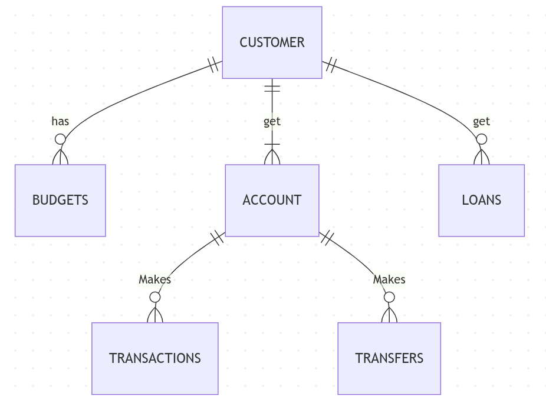

## Scope

The database is designed to keep track of the use of a bank account. It provides to the client with access to the information on the overall use of their account and response to any requirement that could arise. The database scope includes:

*Customer, including personal information.

*Account, including type and their movements to external accounts, that is; trasfers and transactions.

*Budgets, including savings to improve the use of the account.

*loans, including any loan for a customer.

Information about external accounts, that is, accounts belonging to other banks are out of the scope. In addition, bank employees are not represented neither beneficiaries. Places like ATM locations are not included.

## Functional Requirements

A user can save their account information and access anytime. It can also track the movements on their account. And update the information about their budgets and loans.

Information beyond of the scope for the database include support for international transfers, access information about external banks accounts and will not support comments or any requirement from the user. The database has not support for multi currency, therefore It only works in the default currency (US).

## Representation

### Entities

The database includes the following entities:

#### Customer

The `customer` table includes:

* `id`, which specifies the unique ID for the customer as an `INTEGER`. This column thus has the `PRIMARY KEY`.
* `first_name`, which specifies the customer's first name as `TEXT`, given `TEXT` is appropriate for name fields.
* `last_name`, which specifies the customer's last name. `TEXT` is used for the same reason as `first_name`.
* `username`, which specifies the customer's username. `TEXT` is used for the same reason as `first_name`. A `UNIQUE` constraint is added.
* `password`, which specifies the customer's password. `TEXT`is used and is added the `UNIQUE`constraint.
* `started`, which specifies when the customer began their account.
* `email`, which specifies the customer's email. `TEXT` is used and should be `UNIQUE`.

#### Budget

The `budget` table includes:

* `id`, specifies the unique ID for the budget as an `INTEGER`. This column thus has the `PRIMARY KEY`.
* `customer_id`, specifies the unique ID for the customer as an `INTEGER`. This column thus has the `FOREIGN KEY`.
* `budget_name`, specifies the name for the budget as a `TEXT`.
* `limit_amount`, specifies the limit value included in the budget as an `NUMBER`.
* `current_amount`, specifies the actual value the customer in to the budget as an `NUMBER`.
* `start_date`, specifies the date in which start the budget.

#### Loans

The `loans` table includes:

* `id`, specifies the unique ID for the loan as an `INTEGER`. This column thus has the `PRIMARY KEY`.
* `customer_id`, specifies the unique ID for the customer as an `INTEGER`. This column thus has the `FOREIGN KEY`.
* `loan_name`, specifies the loan name as a "TEXT".
* `interest_rate`, specifies the interest rate for the loan as a "NUMBER".
* `loan_amount`, specifies the amount of the loan as a "NUMBER".
* `current_balance`, specifies the current balance of the debt as a "NUMBER".

#### Account

The `account` table includes:

* `id`, specifies the unique ID for the account as an `INTEGER`. This column thus has the `PRIMARY KEY`.
* `customer_id`, specifies the unique ID for the customer as an `INTEGER`. This column thus has the `FOREIGN KEY`.
* `balance`, specifies the current balance in their account as a `NUMBER`.
* `account_type`, specifies the type of the bank account, that is, credit or debit. As "TEXT".
* `account_number`, specifies the number of the banck acocunt as a `NUMBER`.

#### Transactions

The `transactions` table includes:

* `id`, specifies the unique ID for the transaction as an `INTEGER`. This column thus has the `PRIMARY KEY`.
* `account_id`, specifies the unique ID for the account as an `INTEGER`. This column thus has the `FOREIGN KEY`.
* `transaction_date`, specifies the date in which the transaction was made.
* `transaction_type`, specifies the transaction type as "TEXT".
* `ammount`, specifies the amount included in the transaction.
* `status`, specifies the status of the transaction, that is, completed or pending.

#### Transfers

The `transfers` table includes:

* `id`, specifies the unique ID for the transfers as an `INTEGER`. This column thus has the `PRIMARY KEY`.
* `from_account_id`, specifies the unique ID for the account that does the transfers as an `INTEGER`. This column thus has the `FOREIGN KEY`.
* `to_account_id`, specifies the unique ID for the account that receive the transfers as an `INTEGER`.
* `amount`, specifies the amount included in the transaction.
* `transfers_date`, specifies the date in which the transfer was made.
* `status`, specifies the status of the transfer, that is, completed or pending.

### Relationships

the complete entity relation is defined in the below diagram

* A customer can has associate 0 or many budgets. A budget require of one customer. Similarly a customer should have almost one account. A customer could get 0 or many loans.

* The account could makes 0 or many transactions and makes 0 or many transfers.

## Optimizations

We will add indices in the customer table for the `user_name`. Similarly indices in the account table for `balance` and `account_number`. Indices in the transaction table for `amount`.

Could be interesting add a view for the information in the transfers table where the status is pending. In addition, a view that summerize the account information for a customer. Showing a view that provide the total number of loans of a customer is also useful.

## Limitations

Some limitations includes: no daily withdrawal limits, double-entry bookkeeping is not handle. The history of the account cannot be change, there isn't a customer verification process. It is not support the international transfers.

Our database could not represent the loans information, our table is highly simplified. Moreover our current indices could be limited, It is neccesary to look into the possibility in adding more.
